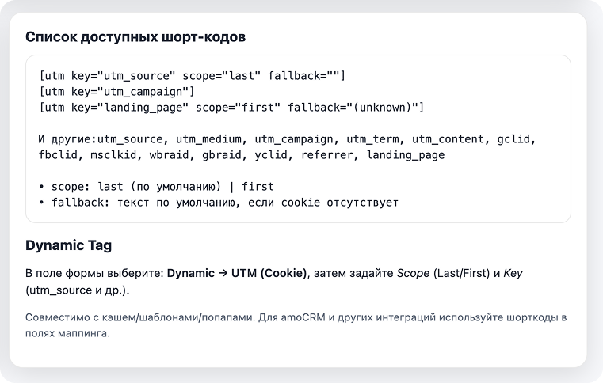
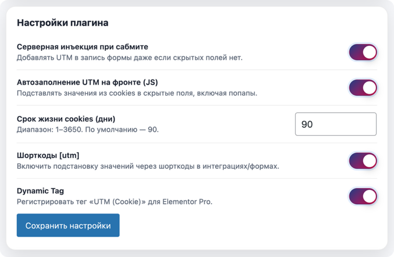

# AmoCRM UTM Elementor

**AmoCRM UTM Elementor** — это WordPress плагин, разработанный для сохранения UTM-меток и кликовых идентификаторов в cookies посетителя (First touch и Last touch) и их последующей удобной передачи в формы Elementor Pro.

## Зачем нужен этот плагин?
Частая проблема маркетологов: пользователь переходит по рекламе с UTM-метками (например, `?utm_source=yandex&utm_medium=cpc`), гуляет по страницам сайта, а затем оставляет заявку. К моменту отправки формы URL сайта уже "чистый", и UTM-метки теряются. Из-за этого в CRM приходят пустые поля источников, и невозможно оценить эффективность рекламы.

**Решение:**
Плагин при первом заходе пользователя перехватывает все рекламные метки из URL и бережно сохраняет их в Cookies браузера на заданный срок (например, на 90 дней). Затем, на какой бы странице и через какое бы время пользователь ни заполнил форму Elementor Pro, плагин автоматически подставит эти метки в скрытые поля формы для отправки в вашу CRM (AmoCRM, Bitrix24), на email или вебхук.

## Основные возможности
- **First/Last touch:** сохраняет метки первого и последнего захода пользователя.
- **Поддержка всех основных меток:** `utm_source`, `utm_medium`, `utm_campaign`, `utm_term`, `utm_content`.
- **Поддержка кликовых ID:** `gclid`, `fbclid`, `msclkid`, `wbraid`, `gbraid`, `yclid`.
- **Дополнительные параметры:** `referrer` (откуда пришел) и `landing_page` (на какую страницу изначально приземлился).
- Подстановка данных через **Dynamic Tag** Elementor.
- Подстановка данных через **Шорткоды**.
- Автоматическое **JS-заполнение** скрытых полей на фронтенде (отлично работает с попапами).
- **Серверная инъекция** при отправке (надежное добавление меток в данные формы даже если полей физически нет).

---

## Как установить и включить

1. Скачайте папку с плагином (или zip-архив) и загрузите в `wp-content/plugins/` вашего сайта.
2. Активируйте плагин **AmoCRM UTM Elementor** в разделе "Плагины" WordPress.
3. Перейдите в меню **Настройки → UTM Elementor Helper**.
4. Включите нужные функции (рекомендуется включить все):
   - **Серверная инъекция при сабмите**
   - **Автозаполнение UTM на фронте (JS)**
   - **Шорткоды [utm]**
   - **Dynamic Tag**
5. Сохраните настройки.

---

## Как использовать в формах Elementor Pro

Есть два основных способа передачи меток в формы Elementor Pro: через **Dynamic Tag (Динамические теги)** и через **Шорткоды**.

### Способ 1: Использование Dynamic Tag (Рекомендуемый)

Это самый правильный и нативный способ для Elementor. 

1. Откройте страницу с вашей формой в редакторе Elementor.
2. Кликните на виджет **Form**, чтобы открыть его настройки.
3. В разделе **Form Fields** (Поля формы) нажмите **+ Add Item** (Добавить элемент), чтобы создать новое поле.
4. Настройте новое поле:
   - **Type** (Тип): выберите `Hidden` (Скрытое). *Посетитель сайта не должен видеть это поле.*
   - **Label** (Ярлык): назовите его понятно, например, `UTM Source`.
5. Перейдите во вкладку **Advanced** (Расширенные) настроек этого поля.
6. Найдите поле **Default Value** (Значение по умолчанию).
7. Справа от поля "Default Value" нажмите на иконку **Dynamic Tags** (Динамические теги — выглядит как стопка монеток).
8. Прокрутите список вниз до раздела **Site** (Сайт) и выберите **UTM (Cookie)**.
9. Кликните по появившемуся значку гаечного ключа 🔧 рядом с надписью "UTM (Cookie)", чтобы открыть настройки тега:
   - **Scope** (Охват): выберите `Last touch` (Последний источник) или `First touch` (Первый источник).
   - **Key** (Ключ): выберите нужную метку из списка (например, `utm_source`).
   - **Fallback** (Резервное значение): можно оставить пустым.
10. Повторите шаги 3-9 для всех остальных нужных вам меток (`utm_medium`, `utm_campaign` и т.д.), создавая для каждой свое скрытое поле.

**Важно для AmoCRM:** Не забудьте в настройках формы в разделе **Actions After Submit** (Действия после отправки) настроить маппинг (сопоставление) этих полей с соответствующими полями в вашей CRM.

---

### Способ 2: Использование шорткодов (Если Dynamic Tag не подходит)

Иногда интеграции сторонних плагинов с Elementor могут некорректно обрабатывать динамические теги. В этом случае на помощь приходят шорткоды.

Шорткоды можно вставлять:
- В поле **Default Value** скрытых полей (вместо Dynamic Tag).
- Прямо в настройки маппинга интеграций (например, в поля вебхука или настройки плагина интеграции с CRM).
- В текст писем, которые отправляет форма.

**Как создать скрытое поле с шорткодом:**
1. В виджете Form добавьте новое поле.
2. **Type**: `Hidden`.
3. **Label**: `UTM Source`.
4. Во вкладке **Advanced** в поле **Default Value** просто вставьте текст шорткода:
   `[utm key="utm_source" scope="last"]`

**Структура шорткода:**
`[utm key="название_метки" scope="first_или_last" fallback="текст_если_пусто"]`

**Примеры:**
- Источник последнего захода: `[utm key="utm_source"]` *(scope="last" применяется по умолчанию)*
- Кампания первого захода: `[utm key="utm_campaign" scope="first"]`
- Страница входа: `[utm key="landing_page" scope="first" fallback="Неизвестно"]`

**Доступные ключи (key):**
`utm_source`, `utm_medium`, `utm_campaign`, `utm_term`, `utm_content`, `gclid`, `fbclid`, `msclkid`, `wbraid`, `gbraid`, `yclid`, `referrer`, `landing_page`.

---

## Если метки всё равно не приходят

Если вы добавили скрытые поля, но данные в CRM приходят пустыми, убедитесь, что:
1. Вы включили опцию **"Автозаполнение UTM на фронте (JS)"** в настройках плагина. JS-скрипт принудительно найдет все скрытые поля с именами `utm_source` и т.д. и заполнит их значениями из Cookies прямо в браузере клиента перед отправкой.
2. Для надежности включите **"Серверная инъекция при сабмите"**. Эта опция перехватывает заявку уже на сервере и жестко добавляет в массив отправляемых данных все найденные у пользователя UTM-метки, даже если вы забыли создать скрытые поля в самой форме.

## 📸 Скриншоты проекта

### Подстановка в формы

### Настройки плагина  

### Интеграция с amoCRM

### Результаты работы

## Поддержка

Для вопросов и поддержки:
- **Сайт:** https://рукодер.рф/
- **Телеграм:** https://t.me/RussCoder
- **VK:** https://vk.com/rucoderweb
- **Instagram:** https://www.instagram.com/rucoder.web/
- **Email:** rucoder.rf@yandex.ru

## Лицензия

GPL v2 or later

---

## ВАЖНО - Авторские права

**Этот плагин является интеллектуальной собственностью разработчика RUCODER.**

⚠️ Распространение, копирование, модификация, продажа данного плагина без письменного разрешения владельца **строго запрещена**.

Нарушение авторских прав преследуется по закону.

### Разработчик

**RUCODER - Разработка сайтов**

- 🌐 Сайт: https://рукодер.рф/
- 📱 Телеграм: https://t.me/RussCoder
- 👥 VK: https://vk.com/rucoderweb
- 📸 Instagram: https://www.instagram.com/rucoder.web/
- 📧 Email: rucoder.rf@yandex.ru

**По всем вопросам и для заказа разработки сайтов обращайтесь по контактным данным выше.**
*Разработчик: Сергей Солошенко | РуКодер*  
*Сайт: https://рукодер.рф*
---

© 2026 RUCODER. Все права защищены.
